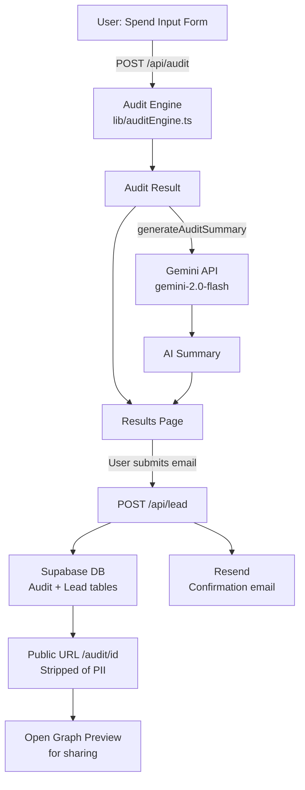

# Architecture — AuditAI

## System Diagram

## Data Flow

1. User fills the spend form → stored in `localStorage` for persistence
2. On submit, `POST /api/audit` runs the rule-based audit engine (no AI)
3. In the same request, `generateAuditSummary()` calls Gemini for a personalized paragraph
4. Results rendered client-side; a unique `auditId` is generated and stored in Supabase
5. User enters email → lead saved to Supabase, confirmation email sent via Resend
6. Public URL `/audit/[id]` loads the stored audit snapshot, strips PII, renders OG tags server-side

## Stack Choices

| Layer | Choice | Reason |
|-------|--------|--------|
| Framework | Next.js App Router | SSR required for OG meta tags on shareable URLs; API routes eliminate a separate backend |
| Language | TypeScript | Assignment preference; catches type errors in audit engine math at compile time |
| Styling | Tailwind + custom UI | Tailwind v4 with hand-rolled components for full control; accessibility built in |
| DB | Supabase (Postgres) | Free tier, real Postgres, instant REST API, no infrastructure to manage |
| Email | Resend | Modern API, free tier (100/day), best DX of the options listed |
| AI | Gemini 2.0 Flash | Fast, cheap, generous free tier; 100-word summary doesn't need a reasoning model |
| Rate limit | Upstash Redis | Serverless-native, free tier, integrates directly with Vercel Edge |
| Deploy | Vercel | Zero-config Next.js, preview deployments per branch |

## 10k Audits/Day

Current architecture is stateless per-request — it would handle 10k/day without changes.
Bottlenecks at scale:
1. **Gemini API rate limits** → add a queue (BullMQ on Redis) to smooth spikes; or cache summaries for identical inputs
2. **Supabase connection pooling** → switch to Supabase's pgBouncer connection string
3. **Resend throughput** → batch sends or switch to SES for higher volume
4. **OG image generation** → pre-generate and cache to S3/R2 instead of on-demand
