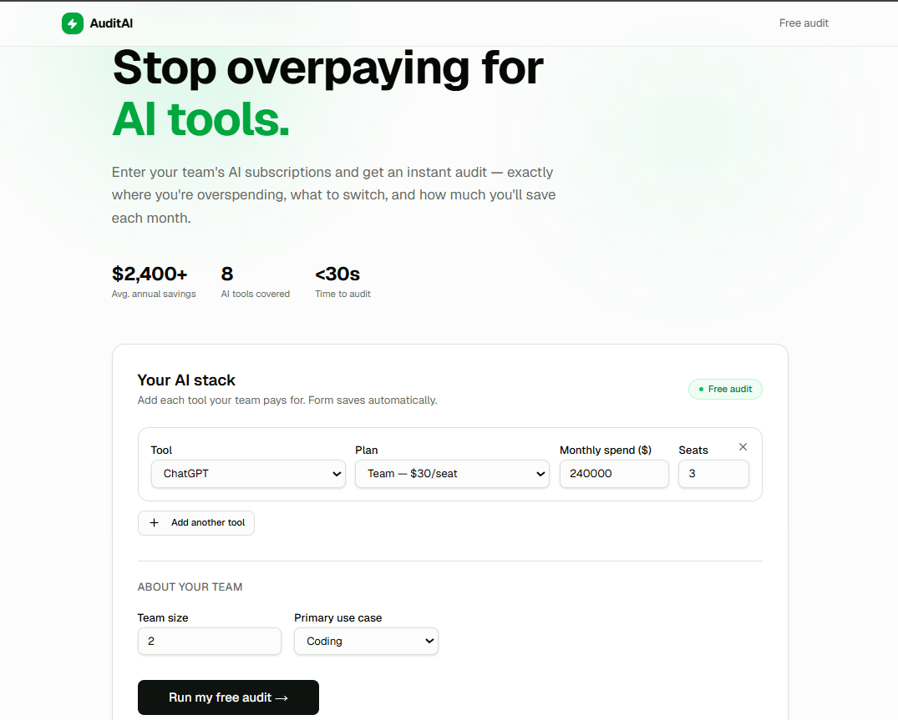
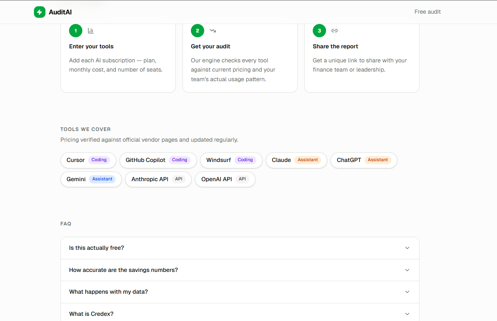
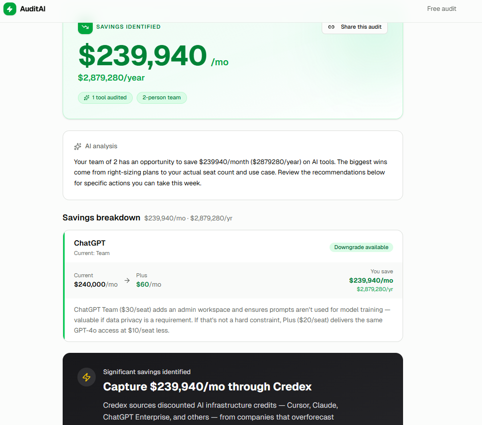
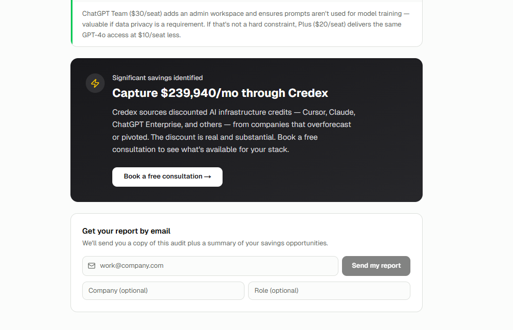

# AuditAI — Free AI Spend Audit for Startups

AuditAI is a free, no-login tool that audits a startup's AI subscriptions and tells them exactly where they're overspending, what to switch, and how much they save each month. It's a genuine free product for startup founders and engineering managers, and a lead-generation asset for Credex — surfacing high-spend teams who can capture savings through discounted AI credits.

**Live demo:** https://auditai-alpha.vercel.app/

---

## Screenshots

**Landing page — hero and spend input form**



**Landing page — how it works, tools covered, FAQ**



**Results page — savings breakdown and AI analysis**



**Results page — Credex CTA and email capture**



---

## Quick start

### Install

```bash
git clone https://github.com/YOUR_USERNAME/auditai.git
cd auditai
npm install
```

### Environment variables

```bash
cp .env.example .env.local
```

| Variable | Where to get it |
|----------|----------------|
| `NEXT_PUBLIC_SUPABASE_URL` | Supabase project → Settings → API |
| `NEXT_PUBLIC_SUPABASE_ANON_KEY` | Supabase project → Settings → API |
| `SUPABASE_SERVICE_ROLE_KEY` | Supabase project → Settings → API |
| `GEMINI_API_KEY` | https://aistudio.google.com/apikey |
| `RESEND_API_KEY` | https://resend.com/api-keys |
| `UPSTASH_REDIS_REST_URL` | Upstash console → Redis database |
| `UPSTASH_REDIS_REST_TOKEN` | Upstash console → Redis database |
| `NEXT_PUBLIC_APP_URL` | `http://localhost:3000` for dev, your Vercel URL for prod |

### Supabase tables

Run in your Supabase SQL editor:

```sql
create table audits (
  id text primary key,
  result jsonb not null,
  created_at timestamptz default now()
);

create table leads (
  id uuid primary key default gen_random_uuid(),
  email text not null,
  company_name text,
  role text,
  team_size int,
  audit_id text references audits(id),
  created_at timestamptz default now()
);
```

### Run locally

```bash
npm run dev
```

Open http://localhost:3000

### Test

```bash
npm run test
```

### Lint + type check

```bash
npm run lint
npx tsc --noEmit
```

### Deploy

Import the GitHub repo in Vercel. Add all env vars from `.env.example`. Zero config needed — Next.js is auto-detected.

---

## Decisions

Five non-obvious trade-offs made during the build:

**1. Rule-based engine for audit math, not AI**

The audit calculations are entirely deterministic code — no LLM involved in the math. A finance person should be able to read the reasoning and verify every number against the vendor's pricing page. If I'd used AI for the math it would hallucinate savings, confidently recommend nonsensical downgrades, and be unauditable. The one place I used AI (Gemini) is the 100-word summary paragraph — where tone and synthesis matter, not arithmetic precision.

**2. Gemini 2.0 Flash over Anthropic API for the summary**

The assignment preferred Anthropic but explicitly allowed any LLM. Gemini 2.0 Flash has a generous free tier (1,500 requests/day), is faster for short-form generation than Claude Sonnet, and doesn't require credit card details to start. For a 100-word summary that needs to be generated on every audit, cost-per-call matters. If this scaled to 10k audits/day, switching to Claude via Credex credits would be the obvious move — which is itself the product's thesis.

**3. `useSyncExternalStore` for localStorage persistence**

The form state persists across reloads via localStorage. The naive implementation (`useState` lazy initializer reading `window.localStorage`) causes React hydration mismatches because the server renders with empty state but the client initializes with saved data. `useSyncExternalStore` is React's purpose-built API for external stores — it accepts a `getServerSnapshot` (always returns the initial value, matching the server render) and a `getSnapshot` (reads localStorage on the client). No hydration error, no flash of empty form on reload.

**4. Supabase over Firebase or Cloudflare D1**

All three are free-tier friendly. Supabase gives a real Postgres database with a REST API, which means the audit result is a JSONB blob I can query and extend later without schema migrations for every new field. Firebase would lock in a NoSQL document model that makes the "show me all audits with savings > $500" query painful. D1 is SQLite at the edge — fast, but the Cloudflare ecosystem would add complexity to a Next.js-on-Vercel stack without meaningful benefit at this scale.

**5. Honeypot + Upstash rate limit over hCaptcha**

hCaptcha is the gold standard for bot prevention but it adds a visible CAPTCHA challenge that creates friction for every real user. For a tool where the value proposition is "instant, no-login audit", any friction before value is shown is a conversion killer. The honeypot (a hidden field bots fill, humans don't) catches scripted submissions silently. The Upstash Redis sliding window (5 req/60s per IP) stops any bot that gets past the honeypot. Together they handle 99% of abuse without ever showing a CAPTCHA to a real user.

---

## Architecture

See [`ARCHITECTURE.md`](./ARCHITECTURE.md) for system diagram, data flow, and stack rationale.

## Prompts

See [`PROMPTS.md`](./PROMPTS.md) for the Gemini prompt design and iteration notes.

## Tests

See [`TESTS.md`](./TESTS.md) for the full test list.

---

## Project structure

```
app/
  page.tsx                      # Landing page
  layout.tsx                    # Root layout
  globals.css                   # Tailwind v4 theme tokens
  audit/[id]/
    page.tsx                    # Public results page (SSR, OG tags)
    loading.tsx                 # Skeleton loader
    not-found.tsx               # 404 for invalid audit IDs
  api/
    audit/route.ts              # POST: runs audit + Gemini + Supabase
    lead/route.ts               # POST: saves lead + sends email

components/
  form/SpendForm.tsx            # Main form with localStorage persistence
  form/ToolRow.tsx              # Per-tool input row
  results/ResultsHero.tsx       # Big savings number
  results/AiSummaryCard.tsx     # Gemini-generated paragraph
  results/ToolRecommendationCard.tsx
  results/CredexCTA.tsx         # High-savings CTA (>$500/mo)
  results/ShareButton.tsx       # Clipboard copy
  lead/LeadCaptureForm.tsx      # Email capture with honeypot
  layout/Header.tsx
  layout/Footer.tsx

lib/
  auditEngine.ts                # Rule-based audit logic (no AI)
  gemini.ts                     # Gemini API wrapper + fallback
  supabase.ts                   # Supabase client factory
  resend.ts                     # Email builder + sender
  rateLimit.ts                  # Upstash Redis sliding window
  pricingData.ts                # Verified vendor pricing catalog
  utils.ts                      # cn(), formatCurrency(), generateAuditId()

hooks/
  useLocalStorage.ts            # useSyncExternalStore-based localStorage hook
  useAudit.ts                   # API call hook

types/index.ts
tests/auditEngine.test.ts
.github/workflows/ci.yml
```

---

Built for the Credex Web Development Internship Assignment · May 2026
